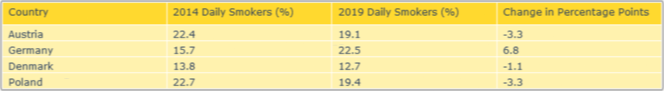
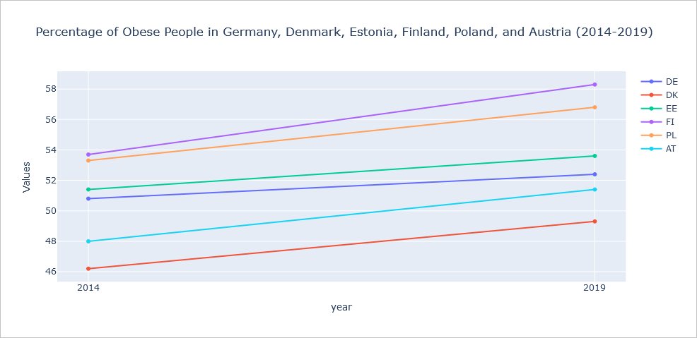
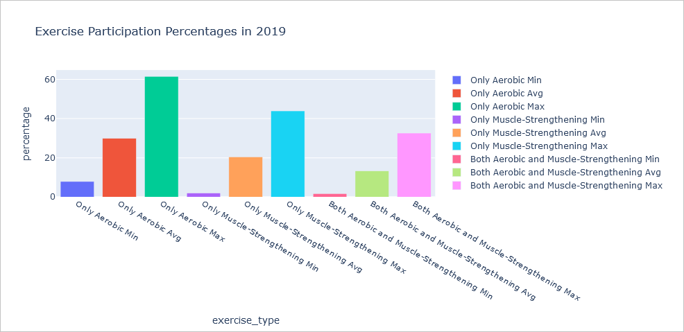
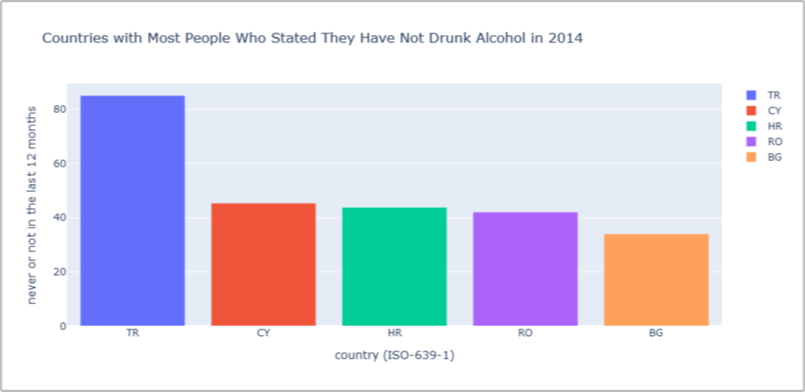

## LangChain SQL Agent for dynamic data visualization 

Example application for the construction and inference of an LLM-based LangChain SQL Agent that can dynamically query a database and invoke multiple visualization tools.
The language model used is OpenAIs [GPT-4o mini](https://openai.com/index/gpt-4o-mini-advancing-cost-efficient-intelligence/).

For this, four datasets from the [European Statistical Office](https://ec.europa.eu/eurostat/databrowser/explore/all/all_themes) (Eurostat) are loaded into a local SQL database that the LLM can query for up to 15 iterations per run. It can then use the results to independently call and output one of three basic visualizations functions based on Plotly.

The four datasets are all sourced from the _Health determinants_ part of Eurostats public dataset API and include statistics on:
- **tobacco consumption** by country of citizenship for the years 2014 and 2019 ([Link](https://ec.europa.eu/eurostat/databrowser/view/hlth_ehis_sk1c/default/table?lang=en))
- **body mass index** (BMI) by country of citizenship for the years 2014 and 2019 ([Link](https://ec.europa.eu/eurostat/databrowser/view/hlth_ehis_bm1c/default/table?lang=en))
- **physical exercise** by country of citizenship for the years 2014 and 2019 ([Link](https://ec.europa.eu/eurostat/databrowser/view/hlth_ehis_pe9c/default/table?lang=en))
- **alcohol consumption** by country of citizenship for the years 2014 and 2019 ([Link](https://ec.europa.eu/eurostat/databrowser/view/hlth_ehis_al1c/default/table?lang=en))

The LLM agent can use the following three tool functions to visualize the results (see [agent_tools.py](https://github.com/EliasK93/LangChain-SQL-Agent-for-dynamic-data-visualization/blob/master/agent_tools.py)):
- **output_table()**: output 2D table contents as a pretty table using Plotly table viewer
- **output_bar_plot()**: output a simple bar plot
- **output_time_series_plot()**: output one or multiple line plots along one main time axis

 

### Example Results

<table>
    <thead>
        <tr>
            <th>User Input</th>
            <th>Agent Output</th>
        </tr>
    </thead>
    <tbody>
        <tr>
            <td>Show me the change in the percentage points of daily smokers between 2014 and 2019 for Germany, Denmark, Poland and Austria in a pretty table (one row per country).</td>
            <td>
                <strong>Plotly Figure:</strong>  
                
                

                <strong>Main SQL query used by the LLM:</strong>  
                <pre><code>SELECT "country (ISO-639-1)", "daily smoker"
FROM smoking_of_tobacco_products
WHERE year IN ('2014', '2019')
AND "country (ISO-639-1)" IN ('DE', 'DK', 'PL', 'AT');</code></pre>
            </td>
        </tr>
        <tr>
            <td>Plot the percentage of people who are obese in Germany, Denmark, Estonia, Finland, Poland and Austria as a time series (one series per country).</td>
            <td>
                <strong>Plotly Figure:</strong>  
                
                

                <strong>Main SQL query used by the LLM:</strong>  
                <pre><code>SELECT year, "country (ISO-639-1)", obese
FROM body_mass_index
WHERE "country (ISO-639-1)" IN ('DE', 'DK', 'EE', 'FI', 'PL', 'AT')
ORDER BY year;</code></pre>
            </td>
        </tr>
        <tr>
            <td>Calculate the minimum, average and maximum percentages of people in 2019 who do only aerobic, only muscle-strengthening and both aerobic and muscle-strengthening exercise and show the result as a bar plot (nine bars overall).</td>
            <td>
                <strong>Plotly Figure:</strong>  
                
                

                <strong>Main SQL query used by the LLM:</strong>  
                <pre><code>SELECT
    MIN(aerobic) AS min_aerobic,
    AVG(aerobic) AS avg_aerobic,
    MAX(aerobic) AS max_aerobic,
    MIN("muscle-strengthening") AS min_muscle_strengthening,
    AVG("muscle-strengthening") AS avg_muscle_strengthening,
    MAX("muscle-strengthening") AS max_muscle_strengthening,
    MIN("aerobic and muscle-strengthening") AS min_aerobic_and_strengthening,
    AVG("aerobic and muscle-strengthening") AS avg_aerobic_and_strengthening,
    MAX("aerobic and muscle-strengthening") AS max_aerobic_and_strengthening
FROM health_enhancing_physical_activity
WHERE year = '2019';</code></pre>
            </td>
        </tr>
        <tr>
            <td>What are the five countries with most people who in 2014 stated that they have not drunk alcohol in the last year? Plot the result as a bar plot.</td>
            <td>
                <strong>Plotly Figure:</strong>  
                
                

                <strong>Main SQL query used by the LLM:</strong>  
                <pre><code>SELECT "country (ISO-639-1)", "never or not in the last 12 months"
FROM alcohol_consumption
WHERE year = '2014'
ORDER BY "never or not in the last 12 months" DESC
LIMIT 5;</code></pre>
            </td>
        </tr>
    </tbody>
</table>
 

### Requirements

##### - Python >= 3.10

##### - pip
  - `langchain`
  - `langchain-community`
  - `langchain-openai`
  - `sqlalchemy`
  - `pydantic`
  - `pandas`
  - `plotly`
