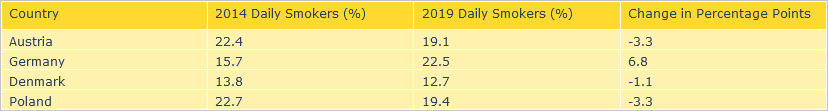
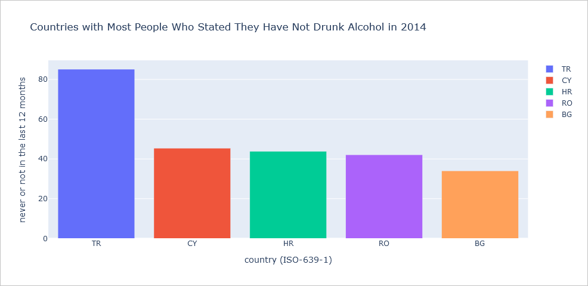

## LangChain SQL Agent for dynamic data visualization 

Example application for the construction and inference of an LLM-based LangChain SQL Agent that can dynamically query a database and invoke multiple visualization tools.
The language model used is OpenAIs [GPT-4o mini](https://openai.com/index/gpt-4o-mini-advancing-cost-efficient-intelligence/).

For this, four datasets from the [European Statistical Office](https://ec.europa.eu/eurostat/databrowser/explore/all/all_themes) (Eurostat) are loaded into a local SQL database that the LLM can query for up to 15 iterations per run. It can then use the results to independently call and output one of three basic visualizations functions based on Plotly.

The four datasets are all sourced from the _Health determinants_ part of Eurostats public dataset API and include statistics on:
- **tobacco consumption** by country of citizenship for the years 2014 and 2019 ([Link](https://ec.europa.eu/eurostat/databrowser/view/hlth_ehis_sk1c/default/table?lang=en))
- **body mass index** (BMI) by country of citizenship for the years 2014 and 2019 ([Link](https://ec.europa.eu/eurostat/databrowser/view/hlth_ehis_bm1c/default/table?lang=en))
- **physical exercise** by country of citizenship for the years 2014 and 2019 ([Link](https://ec.europa.eu/eurostat/databrowser/view/hlth_ehis_pe9c/default/table?lang=en))
- **alcohol consumption** by country of citizenship for the years 2014 and 2019 ([Link](https://ec.europa.eu/eurostat/databrowser/view/hlth_ehis_al1c/default/table?lang=en))

The LLM agent can use the following three tool functions to visualize the results (see [agent_tools.py](https://github.com/EliasK93/LangChain-SQL-Agent-for-dynamic-data-visualization/blob/master/agent_tools.py)):
- **output_table()**: output 2D table contents as a pretty table using Plotly table viewer
- **output_bar_plot()**: output a simple bar plot
- **output_time_series_plot()**: output one or multiple line plots along one main time axis

 

### Example Results

<table>
    <thead>
        <tr>
            <th>Input</th>
            <th>Main SQL query used by the LLM</th>
            <th colspan="2">Output</th>
        </tr>
    </thead>
    <tbody>
        <tr>
            <td>Show me the change in the percentage points of daily smokers between 2014 and 2019 for Germany, Denmark, Poland and Austria in a pretty table (one row per country).</td>
            <td><pre><code>SELECT "country (ISO-639-1)", "daily smoker"</code> <code>FROM smoking_of_tobacco_products</code> <code>WHERE year IN ('2014', '2019')</code> <code>AND "country (ISO-639-1)" IN ('DE', 'DK', 'PL', 'AT');</code></pre></td>
            <td>Here is the change in the percentage points of daily smokers between 2014 and 2019 for Germany, Denmark, Poland, and Austria:  | Country  | 2014 Daily Smokers (%) | 2019 Daily Smokers (%) | Change in Percentage Points | |----------|------------------------|------------------------|-----------------------------| | Austria  | 22.4                   | 19.1                   | -3.3                        | | Germany  | 15.7                   | 22.5                   | 6.8                         | | Denmark  | 13.8                   | 12.7                   | -1.1                        | | Poland   | 22.7                   | 19.4                   | -3.3                        |</td>            
            <td></td>
        </tr>
        <tr>
            <td>Plot the percentage of people who are obese in Germany, Denmark, Estonia, Finland, Poland and Austria as a time series (one series per country).</td>
            <td><pre><code>SELECT year, "country (ISO-639-1)", obese</code> <code>FROM body_mass_index</code> <code>WHERE "country (ISO-639-1)" IN ('DE', 'DK', 'EE', 'FI', 'PL', 'AT')</code> <code>ORDER BY year;</code></pre></td>
            <td>I have plotted the percentage of obese people in Germany, Denmark, Estonia, Finland, Poland, and Austria for the years 2014 and 2019. The data shows the following obesity rates:  - **Austria (AT)**: 48.0% (2014), 51.4% (2019) - **Germany (DE)**: 50.8% (2014), 52.4% (2019) - **Denmark (DK)**: 46.2% (2014), 49.3% (2019) - **Estonia (EE)**: 51.4% (2014), 53.6% (2019) - **Finland (FI)**: 53.7% (2014), 58.3% (2019) - **Poland (PL)**: 53.3% (2014), 56.8% (2019)  If you need further analysis or a different visualization, let me know!</td>
            <td></td>
        </tr>
        <tr>
            <td>Calculate the minimum, average and maximum percentages of people in 2019 who do only aerobic, only muscle-strengthening and both aerobic and muscle-strengthening exercise and show the result as a bar plot (nine bars overall).</td>
            <td><pre><code>SELECT</code> <code>    MIN(aerobic) AS min_aerobic,</code> <code>    AVG(aerobic) AS avg_aerobic,</code> <code>    MAX(aerobic) AS max_aerobic,</code> <code>    MIN("muscle-strengthening") AS min_muscle_strengthening,</code> <code>    AVG("muscle-strengthening") AS avg_muscle_strengthening,</code> <code>    MAX("muscle-strengthening") AS max_muscle_strengthening,</code> <code>    MIN("aerobic and muscle-strengthening") AS min_aerobic_and_strengthening,</code> <code>    AVG("aerobic and muscle-strengthening") AS avg_aerobic_and_strengthening,</code> <code>    MAX("aerobic and muscle-strengthening") AS max_aerobic_and_strengthening</code> <code>FROM health_enhancing_physical_activity</code> <code>WHERE year = '2019';</code></pre></td>
            <td>I have calculated the minimum, average, and maximum percentages of people in 2019 who do only aerobic, only muscle-strengthening, and both aerobic and muscle-strengthening exercises. Here are the results:  - **Aerobic Exercise:**   - Minimum: 7.9%   - Average: 29.90%   - Maximum: 61.5%  - **Muscle-Strengthening Exercise:**   - Minimum: 2.0%   - Average: 20.43%   - Maximum: 43.9%  - **Both Aerobic and Muscle-Strengthening Exercise:**   - Minimum: 1.7%   - Average: 13.27%   - Maximum: 32.6%  Unfortunately, I encountered an issue while trying to generate the bar plot. However, you can visualize the data using the above statistics. If you need further assistance or a different format, please let me know!</td>
            <td></td>
        </tr>
        <tr>
            <td>What are the five countries with most people who in 2014 stated that they have not drunk alcohol in the last year? Plot the result as a bar plot.</td>
            <td><pre><code>SELECT "country (ISO-639-1)", "never or not in the last 12 months"</code> <code>FROM alcohol_consumption</code> <code>WHERE year = '2014'</code> <code>ORDER BY "never or not in the last 12 months" DESC</code> <code>LIMIT 5;</code></pre></td>
            <td>The five countries with the most people who stated they have not drunk alcohol in the last year in 2014 are:  1. Turkey (TR) - 85.1% 2. Cyprus (CY) - 45.4% 3. Croatia (HR) - 43.8% 4. Romania (RO) - 42.1% 5. Bulgaria (BG) - 34.0%  I have plotted the results as a bar plot.</td>
            <td></td>
        </tr>
    </tbody>
</table>
 

### Requirements

##### - Python >= 3.10

##### - pip
  - `langchain`
  - `langchain-community`
  - `langchain-openai`
  - `sqlalchemy`
  - `pydantic`
  - `pandas`
  - `plotly`
